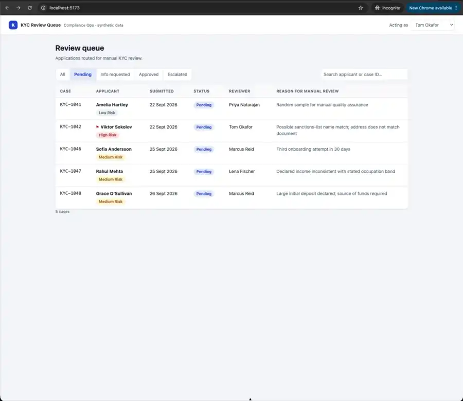
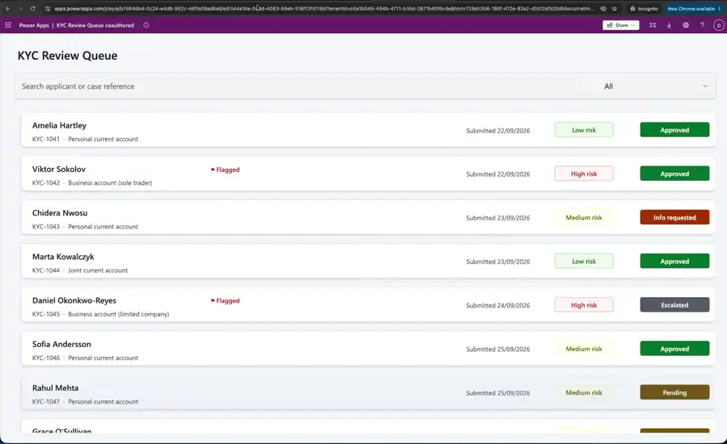
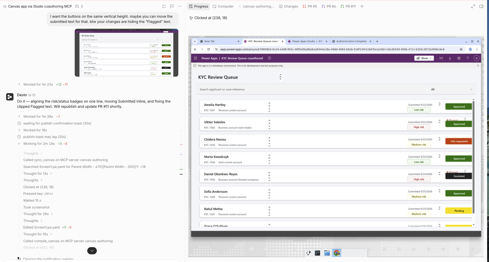
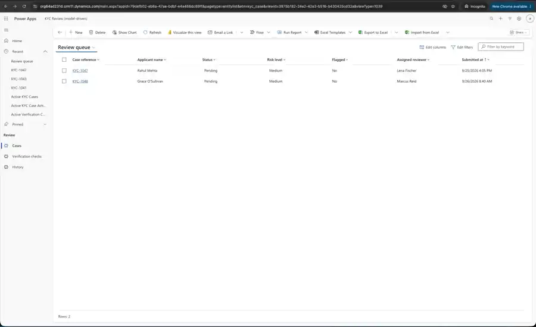

# KYC Review Queue

The same internal compliance tool built three ways, so the approaches can be compared
side by side:

| | What it is | How it was built | Where it runs |
|---|---|---|---|
| **Part A** | Custom web app: React + TypeScript front end, Node/Express API, SQLite | Written as ordinary code in this Git repository | Locally: `npm install && npm run dev` |
| **Part B** | Power Apps **canvas** app on Dataverse | Authored as `.pa.yaml` source through Microsoft's Canvas Authoring MCP server, connected to a live Power Apps Studio session | Power Apps (links below) |
| **Part B′** | Power Apps **model-driven** app on the same Dataverse tables | Generated headlessly from a JSON app spec through the Dataverse API — no Studio, no browser | Power Apps (links below) |

**All data is synthetic.** Names, documents, addresses and check results are invented.

## The workflow

A compliance reviewer works a queue of applicant onboarding cases that were routed for
manual review. In every version the reviewer can:

1. **See the queue** — applicant, submission date, status, assigned reviewer and the reason
   the case needs a human look. Filter by status, search by applicant name or case reference.
   Flagged cases are marked.
2. **Open a case** — the applicant's submitted details, the simulated verification checks
   (pass / review / fail) and the case's activity history.
3. **Decide** — *Approve*, *Request more information* or *Escalate*. A written reason is
   mandatory.
4. **Trust the history** — every submission, assignment, flag and decision is logged with
   who did it, why, and when.
5. **Rely on final decisions** — once a case is *Approved* or *Escalated* it is closed: the
   decision controls lock and the back end refuses further changes. *Info requested* keeps
   the case open for a follow-up decision.

All three versions hold the same eight synthetic cases (see [Seed data](#seed-data)). Each part
below has a short screen recording of the flow.

---

## Part A — custom web app

| Layer | Choice |
|---|---|
| Front end | React 19 + TypeScript, Vite, React Router |
| API | Node.js ≥ 22.13 + Express 5, TypeScript run directly by Node (no build step) |
| Database | SQLite via Node's built-in `node:sqlite` (no native dependencies, no server to run) |
| Tests / lint | `node:test`, ESLint, `tsc --noEmit` |

The front end talks to the API over JSON (`/api/...`); the API validates every decision and
writes the status change and the history entry in one SQLite transaction.



### Run it

Requires Node.js 22.13 or newer (`node --version`; Node 24 recommended).

```bash
npm install
npm run dev        # API on :3001, UI on http://localhost:5173
```

On first start the API creates `server/data/kyc.sqlite` and seeds the eight cases. The file
is kept between restarts, so decisions and history persist.

---

## Part B — Power Apps canvas app

**App:** *KYC Review Queue coauthored* · **Environment:** `https://org64ad231d.crm11.dynamics.com`
(UK region, id `b76846b4-0c24-e4d8-952c-46ffa09ad6a8`)

- Play: <https://apps.powerapps.com/play/e/b76846b4-0c24-e4d8-952c-46ffa09ad6a8/a/6344a16e-0ddd-4083-b5eb-518f13f4116d?tenantId=c6a3b549-494b-4711-b35d-2671b4f06cde>
- Edit in Studio: <https://make.powerapps.com/environments/b76846b4-0c24-e4d8-952c-46ffa09ad6a8/apps/6344a16e-0ddd-4083-b5eb-518f13f4116d>

Sign in to <https://make.powerapps.com> with an account that has access to that environment
and select it in the environment switcher (top right). **Tables → KYC Case / Verification
Check / KYC Case Activity** show the seeded records.



### How it was built

1. **Data first.** The three Dataverse tables were created by scripts in `dataverse/`
   (see [Rebuilding the Dataverse side](#rebuilding-the-dataverse-side)). `dataverse/scripts/schema.ts`
   mirrors the SQLite schema, and the seed reuses `server/src/seed.ts`, so Parts A and B hold
   identical data.
2. **App authored as source.** A Power Apps Studio tab is opened on the app and signed in by
   a person; Microsoft's Canvas Authoring MCP server attaches to that live *coauthoring
   session*. The screens are written as `.pa.yaml` files, validated and pushed with
   `compile_canvas`, and the server-normalised source is pulled back with `sync_canvas`.
   The result is a real app that opens in Studio, publishes and plays — and committable
   source rather than an opaque `.msapp`.
3. **Constraint:** the Studio tab must stay open and signed in throughout; the process is
   agent-driven but not unattended.



*Building Part B: agent session on the left, the live Studio coauthoring session it is driving on
the right.*

Source lives in `powerapps-coauthored/` (`REPORT.md` has the notes on what worked and what did
not). Two screens: the queue (search + status filter over `KYC Cases`, flag and risk markers) and
the case detail (applicant fields, checks, history, required-reason input, Approve / Request
info / Escalate buttons that `Patch` the case and append an activity row; Approved / Escalated
cases are locked).

---

## Part B′ — Power Apps model-driven app, built headlessly

**App:** *KYC Review (model-driven)*, same environment and tables as Part B.

- Play: <https://org64ad231d.crm11.dynamics.com/main.aspx?appid=79defb02-eb8a-47ae-bdbf-e4a466dc89ff>



### How it was built

1. `powerapps-model/app-spec.json` describes the app: which tables to reuse, the views
   (Review queue / Flagged cases / All cases / Case history / Checks), the case form with
   verification-check and history sub-grids, and the Approve / Request information / Escalate
   command-bar buttons.
2. Microsoft's `model-apps` builder (`build-model-app.js --apply --publish --verify`) reads the
   spec and creates every artifact — solution, views, form, commands, web resource, app module —
   through the Dataverse Web API as a service principal, then reads them back to verify.
   **No Studio, no browser, no human in the loop.**
3. `powerapps-model/postbuild.mts` applies the finishing touches the builder does not
   (default view, keyword search, form script).

The reason-required and final-state rules live in `powerapps-model/kyc_casecommands.js`
(form `onload` / `onchange` handlers) rather than as Dataverse business rules: this
environment rejects every business-rule creation with HTTP 400. `powerapps-model/workflow-log.md`
records what was run and what failed.

---

## Rebuilding the Dataverse side

Parts B and B′ share three Dataverse tables (`kyc_case`, `kyc_verificationcheck`,
`kyc_caseactivity`), created and seeded by scripts in `dataverse/`, authenticated as a
service principal that is an application user in the environment:

```bash
export PP_ENV_URL=https://org64ad231d.crm11.dynamics.com
export PP_TENANT_ID=c6a3b549-494b-4711-b35d-2671b4f06cde
export PP_CLIENT_ID=...  PP_CLIENT_SECRET=...

npm run provision -w dataverse   # publisher, solution, tables, columns, relationships (idempotent)
npm run seed -w dataverse        # the eight cases (idempotent; add `-- --reset` to wipe and reseed)
```

Then, for Part B′: run the `model-apps` builder against `powerapps-model/app-spec.json`, followed
by `node powerapps-model/postbuild.mts` (same `PP_*` variables). Part B is rebuilt by pushing
`powerapps-coauthored/app-src/` through the Canvas Authoring MCP server with a Studio session open.

---

## Seed data

| Case | Applicant | Status | Why it is in the queue |
|---|---|---|---|
| KYC-1041 | Amelia Hartley | pending | Ordinary case: random QA sample, all checks pass |
| KYC-1042 | Viktor Sokolov | pending | **Flagged**: sanctions fuzzy match, address check failed |
| KYC-1043 | Chidera Nwosu | info_requested | Document expires within 30 days |
| KYC-1044 | Marta Kowalczyk | approved | Selfie match below auto-approve threshold (already decided) |
| KYC-1045 | Daniel Okonkwo-Reyes | escalated | Confirmed PEP (already escalated) |
| KYC-1046 | Sofia Andersson | pending | Third onboarding attempt in 30 days |
| KYC-1047 | Rahul Mehta | pending | Declared income inconsistent with occupation |
| KYC-1048 | Grace O'Sullivan | pending | Large initial deposit, source of funds required |

## Known limitations

- No authentication or authorisation in Part A; the acting reviewer is chosen from a dropdown.
- Verification checks are static seed data, not calls to a real KYC provider.
- Part A uses a single SQLite file — fine for a prototype, not for multi-instance deployment.
- No "reject" decision: the brief asked for approve / request info / escalate only.
- Parts B and B′ exist only in the developer environment they were built in; there is no
  exported solution package to install them anywhere else.
